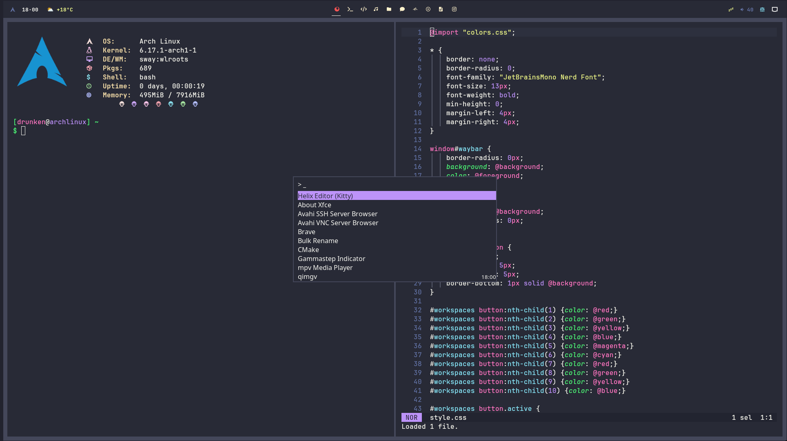

# Sway Install Script



This repository contains an automated installer that sets up a Dracula-themed Sway desktop environment on a freshly installed Arch Linux system. It installs core Wayland tooling, productivity utilities, fonts, and quality-of-life tweaks so you can log in and start working immediately.

## Prerequisites

Run the official Arch installer (`archinstall`) and make sure these options are selected:

- Authentication: `User account` -> `add user` and grant it `administrator privileges`
- Profile: `minimal`
- Applications -> Audio: `pipewire`
- Network configuration: `Copy ISO network configuration to installation`
- Additional packages: `git` or install git before running the script.

After installation finishes and you reboot into the new system, create a regular user with sudo privileges (if `archinstall` has not already done that) and sign in before running the script below.

## Usage

1. Ensure `git` is available and clone the repository:

   ```bash
   sudo pacman -S --needed git
   cd ~
   git clone https://github.com/DrunkenAlcoholic/sway-install.git
   ```

2. Run the installer from inside the cloned directory:

   ```bash
   cd sway-install
   ./sway_install_script.sh
   ```

The installer must not be run as root; it prompts for your sudo password whenever elevated privileges are required and asks for confirmation before proceeding.

## What the Script Installs

- Sway window manager, Waybar panel, swaylock/swayidle, and supporting Wayland tools
- Kitty terminal, Thunar file manager, notification daemon (mako), screenshot utilities (grim, slurp, swappy)
- PipeWire audio stack with WirePlumber session manager
- Paru AUR helper plus AUR packages such as qimgv image viewer, Dracula GTK/icons, NimLaunch, and Nymph
- Dracula GTK theme, Dracula icons, Bibata cursor theme, Nerd Fonts, and environment configuration for GTK/Qt apps
- System services: NetworkManager, Bluetooth, user-level PipeWire services (when available)
- Custom configuration files placed under `~/.config/`

## Post-Install Notes

- Reboot after the script completes so SDDM and the configured services start cleanly.
- When Sway starts, basic key bindings include `Super+Enter` (Kitty terminal), `Super+D` (NimLaunch), `Super+B` (Brave browser), `Super+N` (Thunar file manager), `Super+Shift+Q` (close window), and `Super+Shift+E` (exit Sway).
- Cursor theming: the script installs Bibata and writes `~/.icons/default/index.theme` so the cursor is consistent across GTK, Qt, and Wayland applications.

## Troubleshooting

- If `paru` fails to build, ensure that `base-devel` is installed (the script installs it automatically) and that you have network access.
- Running the script twice is safe; package groups use `--needed` and configuration syncs refresh existing files.
- The installer backs up any existing `~/.bashrc` (timestamped) before installing the repository version; adjust it afterwards if desired.

Feel free to fork this repository and adjust the package selection or configuration files to match your workflow.
